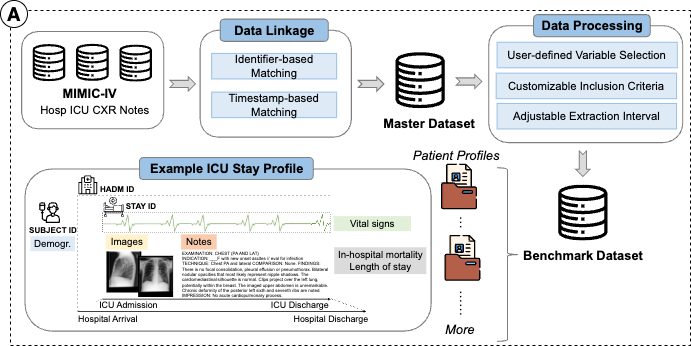
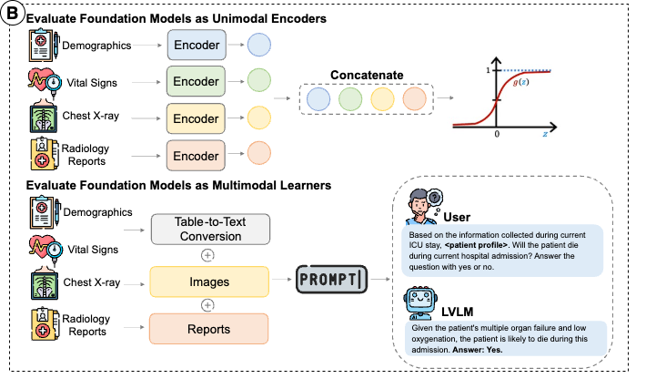
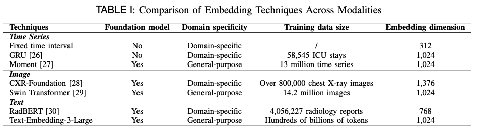

Benchmarking Foundation Models with Multimodal Public Electronic Health Records
=========================
## Table of contents
* [Introduction](#introduction)
* [Structure](#structure)
* [Data Requirements](#data-requirements)
* [Workflow](#workflow)
* [Contact](#contact)

## Introduction
Foundation models have shown great promise in processing electronic health records (EHRs), offering the flexibility to handle diverse medical data modalities such as text, time series, and images. This repository presents a comprehensive benchmark framework designed to evaluate the predictive performance, fairness, and interpretability of foundation models—both as unimodal encoders and multimodal learners—using the publicly available MIMIC-IV database.

To support consistent and reproducible evaluation, we developed a standardized data processing pipeline that harmonizes heterogeneous clin-
ical records into an analysis-ready format. We systematically compared eight foundation models, encompassing both unimodal and multimodal models, as well as domain-specific and general-purpose variants.

## Structure
The structure of this repository is detailed as follows:

- `scripts/1_...` contains the scripts for data processing pipeline
- `scripts/2_... & 3_...` contains the scripts for evaluating foundation models as unimodal encoders
- `scripts/4_..._...` contains the scripts for evaluating foundation models as multimodal learners

## Data Requirements

For data access and description, please visit: [https://mimic.mit.edu](https://mimic.mit.edu/)

MIMIC-IV v2.2 [https://physionet.org/content/mimiciv/2.2](https://physionet.org/content/mimiciv/2.2/#files-panel)

MIMIC-CXR [https://physionet.org/content/mimic-cxr/2.0.0](https://physionet.org/content/mimic-cxr/2.0.0/#files-panel)

MIMIC-IV-Note [https://physionet.org/content/mimic-iv-note/2.2/note](https://physionet.org/content/mimic-iv-note/2.2/note/#files-panel)

## Workflow
The following sub-sections describe the workflow for our benchmark and how they should ideally be run.

### 1. Data Processing Pipeline

For generating master dataset, run `1_1 Master Dataset Generation.ipynb`

For generating benchmark dataset, we used
~~~
python "1_2 Data Processing Pipeline.py --input-path {input_path} --output-pkl-path {output_pkl_path} --output-csv-path {output_csv_path} --age-lower 18 --start-diff 0 --end-diff 24
~~~

**Key Arguements**:

- `input_path` : Path to master dataset.
- `output_pkl_path ` : Output path for processed ICU stay data.
- `output_csv_path ` : Output path for metadata table.
- `age_lower` : Lower bound of patient age.
- `start_diff` : Time difference between the start of information collection period and ICU admission time(positive/negative) in hour
- `end_diff` : Time difference between the end of information collection period and ICU admission time(positive only) in hour
- For the full list of arguments, please refer to the script `1_2 Data Processing Pipeline.py`

**Addition of Two New Outcomes**

In the updated pipeline, we integrated two additional clinical outcomes that are not directly stored in the raw MIMIC-IV tables. To obtain these variables, we queried Google BigQuery using the official SQL definitions provided by the MIMIC team. 

The relevant concept queries are available in the MIMIC Code Repository:

 [https://github.com/MIT-LCP/mimic-code/tree/main/mimic-iv/concepts](https://github.com/MIT-LCP/mimic-code/tree/main/mimic-iv/concepts)
 
The retrieved outcomes were merged into the metadata table of our benchmark dataset to ensure consistent and reproducible outcome generation.

### 2. Benchmark

#### 2.1 Evaluating Foundation Models as Unimodal Encoders

For extracting representations from each data modality,

**Demographics**
~~~
python "2_1 Embedding Extraction for Demographics.py" --input-icu-path {input_icu_path} --input-metadata-path {input_metadata_path} --output-path {output_path}
~~~
- `input_icu_path` : Path to processed ICU stay data
- `input_metadata_path` : Path to metadata table
- `output_path ` : Output path for extracted embeddings

**Time-series**
~~~
python "2_2 Embedding Extraction for Time-series.py" --input-icu-path {input_icu_path} --input-metadata-path {input_metadata_path} --output-path {output_path} --emb-technique {emb_technique}
~~~
- `emb_technique ` : Select from three embedding techniques for time-series data: fixed time interval / gru / moment

**Images**

For extracting embeddings with CXR-Foundation, we recommend run `2_3_1 Embedding Extraction with CXR-Foundation.ipynb` with Google Colab

For extracting embeddings with Swin Transformer,
~~~
python "2_3_2 Embedding Extraction with Swin Transformer.py" --input-icu-path {input_icu_path} --input-metadata-path {input_metadata_path} --output-path {output_path}
~~~

**Notes**
~~~
python "2_4 Embedding Extraction for Clinical Notes.py" --input-icu-path {input_icu_path} --input-metadata-path {input_metadata_path} --output-path {output_path} --emb-technique {emb_technique}
~~~
- `emb_technique ` : Select from two embedding techniques for free-text data: openai / radbert

For combine embeddings from each data modalities into a unified representation and train Logistic Regression for outcome prediction,
~~~
python "3_1 Classification.py" --input-icu-path {input_icu_path} --input-metadata-path {input_metadata_path} --embedding-path {embedding_path} --output-path {output_path} 
--time-series-model {time_series_model} --image-model {image_model} --text-model {text_model} --outcome {outcome}
~~~
- `embedding_path ` : Path to extracted embeddings
- `output_path ` : Output path for predicted results
- `time_series_model ` : Model used for extracting embeddings from time-series data
- `image_model ` : Model used for extracting embeddings from image data
- `text_model ` : Model used for extracting embeddings from free-text data
- `outcome ` : Outcome of interest: in-hospital motality/ length of stay

#### 2.2 Evaluating Foundation Models as Multimodal Learners
For generating prompts for large vision-language models, run `4_1 Generate QA Dataset.ipynb`

## Contact

- Kunyu Yu (Email: <kunyu.yu@u.duke.nus.edu>)
- Nan Liu (Email: <liu.nan@duke-nus.edu.sg>)

